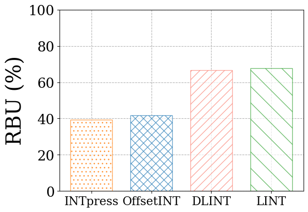
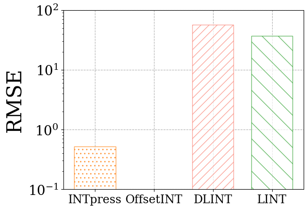
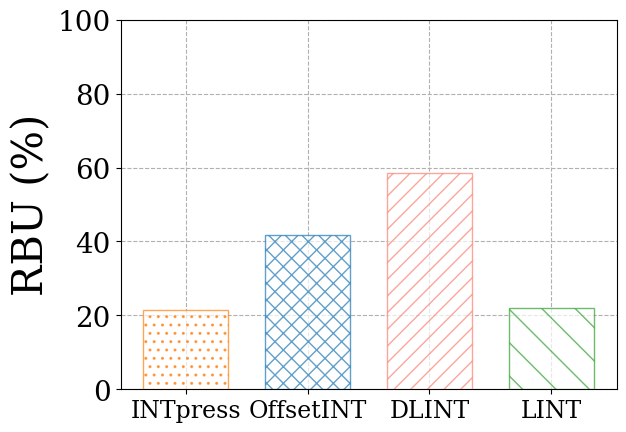
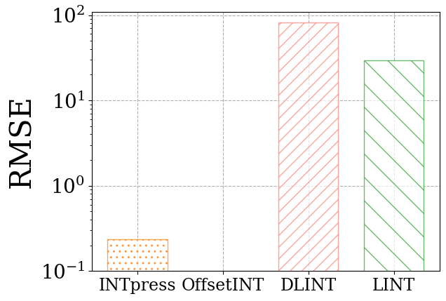
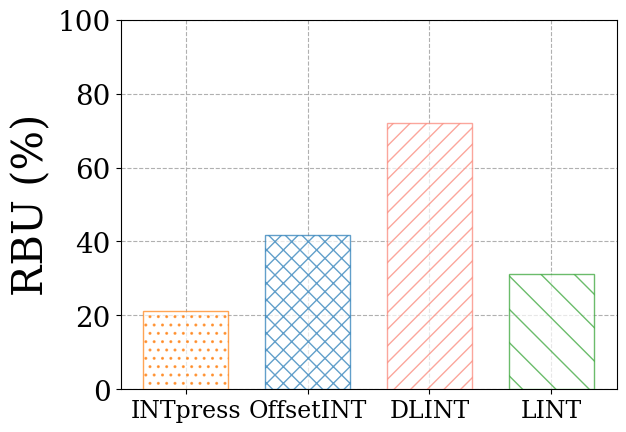
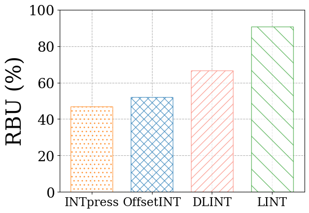
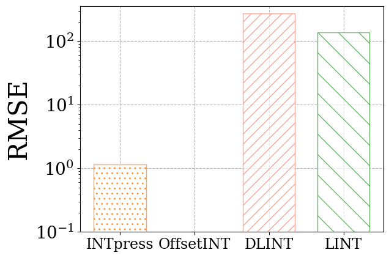

# INTpress

  
Although in-band network telemetry (INT) allows for real-time and fine-grained network monitoring through a programmable data plane, it also adds to bandwidth overhead due to embedding network details in the packet headers. To mitigate this overhead, a compression technique can be used; yet, applying such compression in the data plane poses another challenge, as it may surpass available hardware resources. To tackle this, we introduce a compression-based quantized INT (INTpress), designed to efficiently decrease overhead by encoding data into shorter bit lengths in a manner native to the data plane. We also develop a dynamic data partition algorithm that formulates compression rules balancing monitoring accuracy and bandwidth usage. We implemented the INTpress switch using Tofino programmable switches, facilitating serialization to adeptly manage variable-length compressed bit streams, thus significantly cutting down bandwidth usage. 

# Performance Results

## BMv2 environments
### Data center networks

<table>
  <tr>
    <td align="center"></td>
    <td align="center"></td>
  </tr>
  <tr>
    <td align="center">RBU of queue</td>
    <td align="center">RMSE of hop queue</td>
  </tr>
</table>

### Backbone Network

<table>
  <tr>
    <td align="center"></td>
    <td align="center"></td>
  </tr>
  <tr>
    <td align="center">RBU of queue</td>
    <td align="center">RMSE of hop queue</td>
  </tr>
</table>

### Mobile core networks

<table>
  <tr>
    <td align="center"></td>
    <td align="center"></td>
  </tr>
  <tr>
    <td align="center">RBU of queue</td>
    <td align="center">RMSE of hop queue</td>
  </tr>
</table>

## Tofino environments
### Topology
This is the topology used during the performance evaluation of INTpress on the Tofino:

Traffic was generated with DPDK and sent by host1 towards host2, with each switch running the INTpress pipeline.

### Performances

<table>
  <tr>
    <td align="center"></td>
    <td align="center"></td>
  </tr>
  <tr>
    <td align="center">RBU of queue</td>
    <td align="center">RMSE of hop queue</td>
  </tr>
</table>
