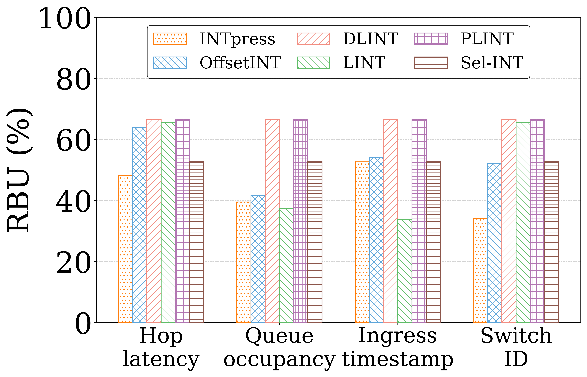
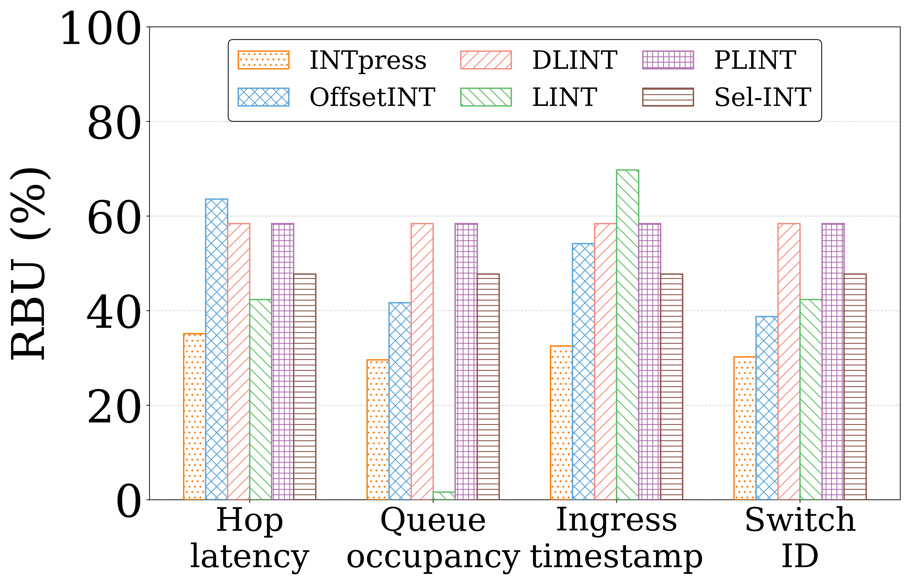
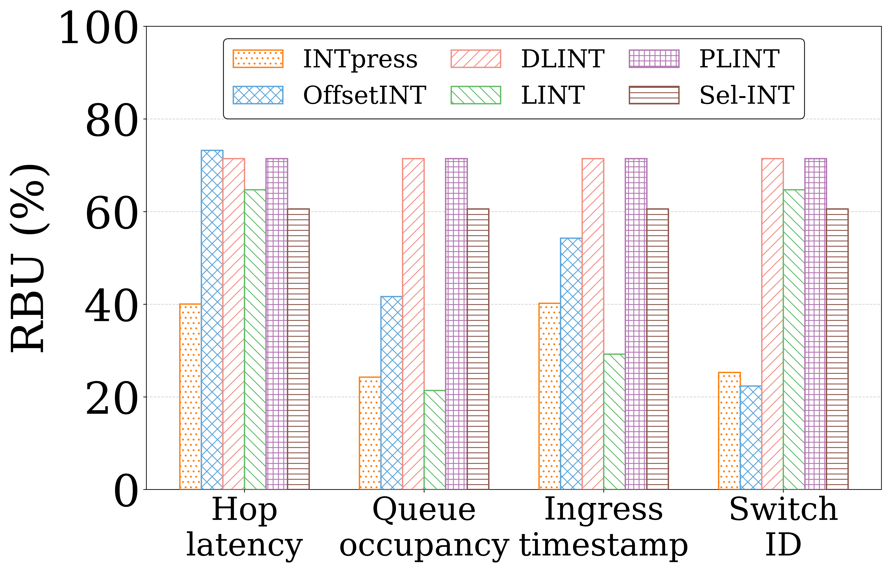
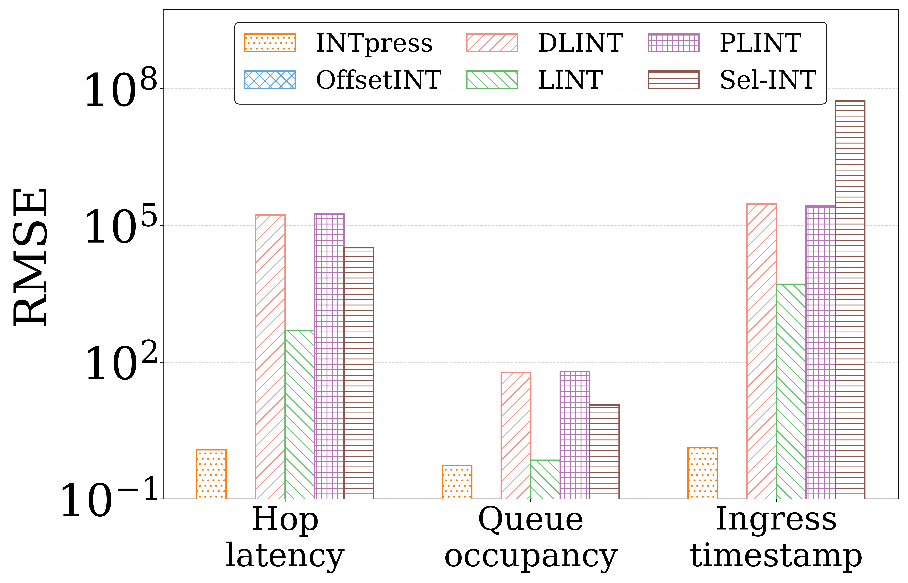
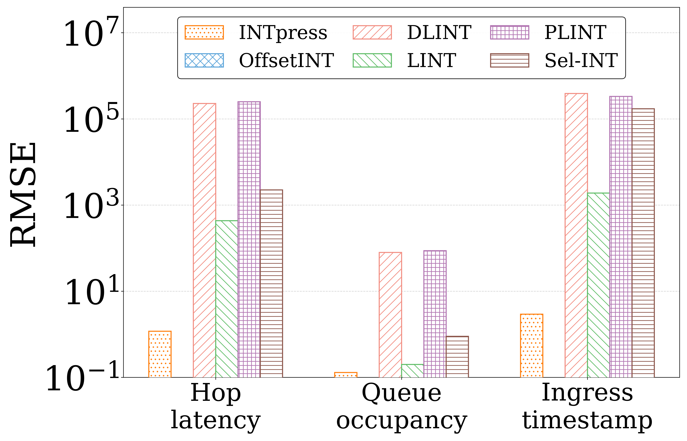
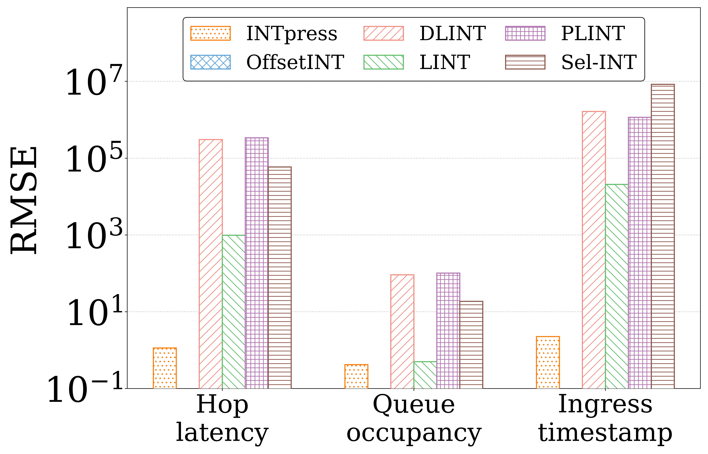
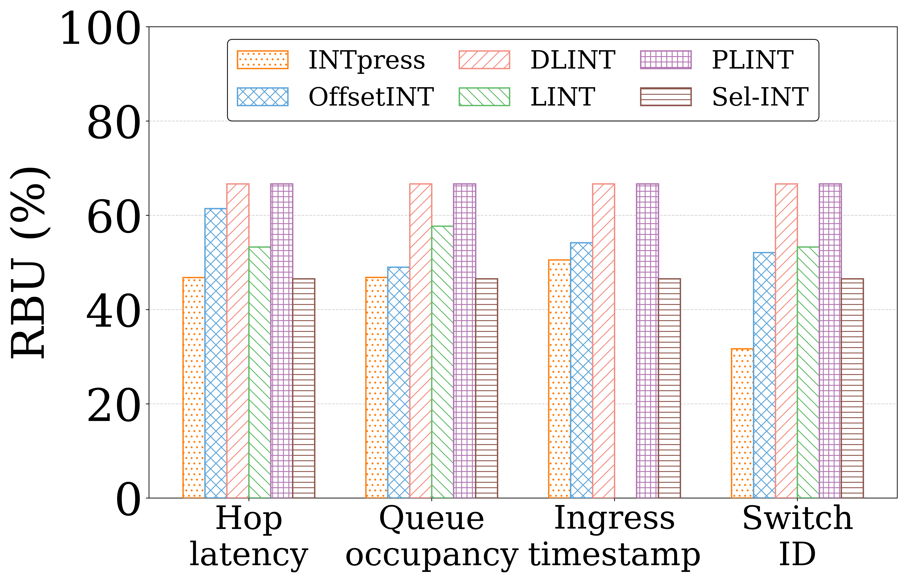
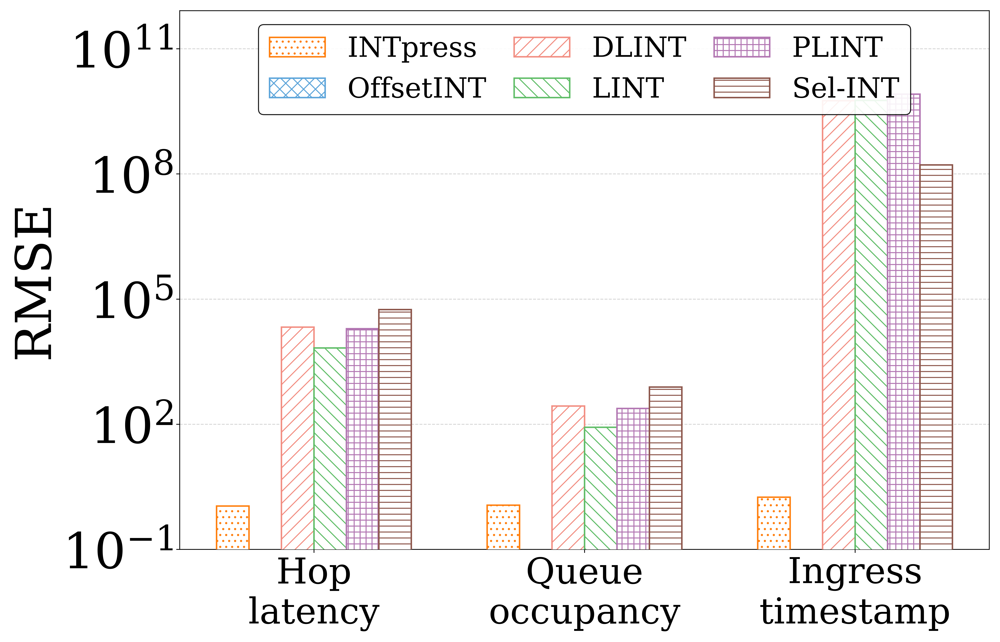

# INTpress

  
Although in-band network telemetry (INT) allows for real-time and fine-grained network monitoring through a programmable data plane, it also adds to bandwidth overhead due to embedding network details in the packet headers. To mitigate this overhead, a compression technique can be used; yet, applying such compression in the data plane poses another challenge, as it may surpass available hardware resources. To tackle this, we introduce a compression-based quantized INT (INTpress), designed to efficiently decrease overhead by encoding data into shorter bit lengths in a manner native to the data plane. We also develop a dynamic data partitioning algorithm that formulates compression rules to balance monitoring accuracy and bandwidth usage. We implemented the INTpress switch using Tofino programmable switches, facilitating serialization to adeptly manage variable-length compressed bit streams, thus significantly reducing bandwidth usage. Our comprehensive experiments demonstrate the efficacy of INTpress across diverse network settings, including data center networks, backbone networks, and mobile core networks. The evaluation results show that INTpress can reduce bandwidth overhead by up to 66.01% relative to existing INT solutions, while preserving a high level of accuracy.

# Performance Results

## BMv2 environments
### Relative bandwidth usage (RBU)

<table>
  <tr>
    <td align="center"></td>
    <td align="center"></td>
    <td align="center"></td>
  </tr>
  <tr>
    <td align="center">Data center networks</td>
    <td align="center">Backbone networks</td>
    <td align="center">Mobile core networks</td>
  </tr>
</table>

### Root mean square error (RMSE)

<table>
  <tr>
    <td align="center"></td>
    <td align="center"></td>
    <td align="center"></td>
  </tr>
  <tr>
    <td align="center">Data center networks</td>
    <td align="center">Backbone networks</td>
    <td align="center">Mobile core networks</td>
  </tr>
</table>

## Tofino environments
### Topology
This is the topology used during the performance evaluation of INTpress on the Tofino:

Traffic was generated with DPDK and sent by host1 towards host2, with each switch running the INTpress pipeline.

### Performances

<table>
  <tr>
    <td align="center"></td>
    <td align="center"></td>
  </tr>
  <tr>
    <td align="center">RBU of queue</td>
    <td align="center">RMSE of queue</td>
  </tr>
</table>
